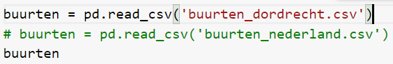

## importing BAG
1. download the BAG data from the following URL: https://geodata.nationaalgeoregister.nl/inspireadressen/extract/inspireadressen.zip

2. pull the latest version of NLExtract https://github.com/nlextract/NLExtract/

3. run an instance of postgresql with the postgis extension and create a database and schema

4. open NLExtract\bag\extract.conf and add the credentials needed for the database connection

5. extract the downloaded inspireadressen.zip into the folder NLExtract\bag\db\data

6. execute "NLExtract\bag\bin\bag-extract.sh -c" to import the bag into the postgis database

## importing cbs buurt- en wijkkaart
1. download the cbs data from https://www.cbs.nl/nl-nl/dossier/nederland-regionaal/geografische-data/wijk-en-buurtkaart-2020
 
2. download the postgis bundle http://download.osgeo.org/postgis/windows/pg96/postgis-bundle-pg96-3.1.1x64.zip

3. extract the cbs data

4. extract the postgis bundle

5. open \bin\postgisgui\shp2pgsql-gui

6. click view connection details and enter the postgis database credentials and a new schema for the cbs data

7. click ok

8. click the import tab and add file and go to the extracted cbs data

9. select the .shp files and click ok

10. click the srid column and change the srid from 0 to 28992

11. click import to import the data into the db

## required datasets for generating population data
- Neighbourhoods from cbs wijk- en buurtkaart https://www.cbs.nl/nl-nl/dossier/nederland-regionaal/geografische-data/wijk-en-buurtkaart-2020
- Household compositions per municipality https://opendata.cbs.nl/statline/#/CBS/nl/dataset/71486NED/table?fromstatweb
- Average living area per household per person https://www.cbs.nl/nl-nl/achtergrond/2018/22/woonoppervlakte-in-nederland
- Amount of persons per age group per household type https://opendata.cbs.nl/#/CBS/nl/dataset/71488ned/table?dl=25C1C
- verblijfsobjecten with neighbourhood code, identification, square meters, verblijfsobjectfunction from the BAG data

The verblijfsobjecten dataset is selected from the BAG and cbs data by using the following sql query:

```sql select bu.bu_code, vbo.identificatie, vbo.oppervlakteverblijfsobject, vbogd.gebruiksdoelverblijfsobject
from bag.verblijfsobjectactueelbestaand vbo
left join cbs.buurten bu
on st_contains(bu.geovlak, vbo.geopunt)
left join bag.verblijfsobjectgebruiksdoelactueelbestaand vbogd
on vbogd.identificatie = vbo.identificatie
where bu.gm_code = 'GM0505'  -- <-- used to only select for a specific municipality, remove to retrieve data for the whole netherlands
```

download this data as csv to use it in the generation process


## step 1 loading and cleaning data
The dataset with average living area per household per person is enriched by added new municipalities based on more recent data because this data is from 2018 and in the meantime more municipalities have been added or have been merged resulting in more/different neighbourhoods

Neighbourhood data is split into 2 sets: complete and incomplete neighbourhoods, complete neighbourhoods have all the data that is required to accurately generate population data. Incomplete neighbourhoods miss certain data fields and require an adjusted population generation process.

## step 2 generating data
Data can be generate for every municipality in the netherlands, but also for a single municipality. To do this, it is needed to change the dataset with all neighbourhood data to only the neighbourhood data needed for generation. This is can also be done for the verblijfsobjecten dataset, only add the verblijfsobjecten for the specific municipality you need. This will work as long as the verblijfsobjecten and municipality data match.



### 2.1 the generation process
Generation of population data is done per neighbourhood. all data corresponding to this neighbourhood is selected (residential buildings, non-residential buildings, all the other data that is imported through previously mentioned data sets).

In order to accurately generate population data the following steps are undertaken:

- The municipality data is selected that corresponds with the neighbourhood so these statistics can be used to project the ratio's of households onto the neighbourhood data.

- The number of households for each household type is calculated.

- The number of persons per age group is calculated

- The number of persons in a type of household is calculated per age group using the municipality ratio's

- Results of these ratio's are used to scale the total number of persons in the calculated age group distribution up or down so the totals match with the totals in the neighbourhood data.

After these steps are done, the results are used to 'create' the population. A dictionary is made for each person in an age group so this can be used in the household generation.

When dictionaries are made all children are added to a queue in order to match them with parents. The matching with parents is done by getting a child from the queue and looping through the available parents untill the child is added to a family. This is done until the calculated limit is reached. This limit is an indication of how many families of 2/3/4/5+ persons are present in a neighbourhood.

After this is done, generated households are added to a dataframe that holds all families with the link to the neighbourhood that has been processed.

The incomplete neighbourhoods are used in a similar generation but with extra/different code in order to accurately generate households for the incomplete neighbourhoods.

For each neighbourhood there is also a function that calculates the max amount of people in a building with non-residential purposes such as offices

When all generation is done, the data is exported to CSV.

### 2.2 running the generation process
In order to start generation, all datasets must be present in the same folder as the python script. All data is available for running the example with the municipality Dordrecht.

In order to start the generation execute the following python command in the same folder: python generate_population.py

## step 3 importing into db

Run the population_table.sql file from the sql folder to create the table for population data. After the table is created, right click it and select import/export to import the created csv. In this window click the slider that says export to enable import mode, select the 3 dots next to the filename field to open the file browser. In the top right click the upload button in order to upload the created csv. Select your file after uploading and click ok, and then ok again to start importing.

## step 4 creating summarised data function in database
to select data for partailly selected neighbourhoods the sql files in the sql folder of this repository should be executed in the newly created database. This will create a function for building partial neigbourhoods based on the generated population data