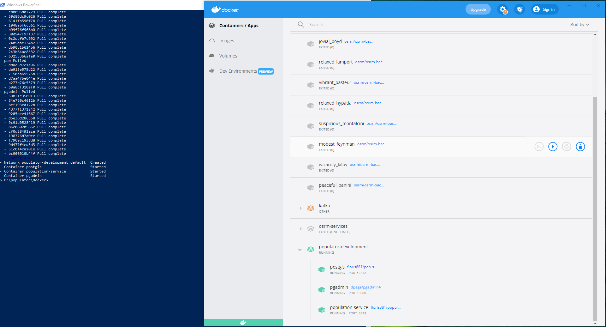
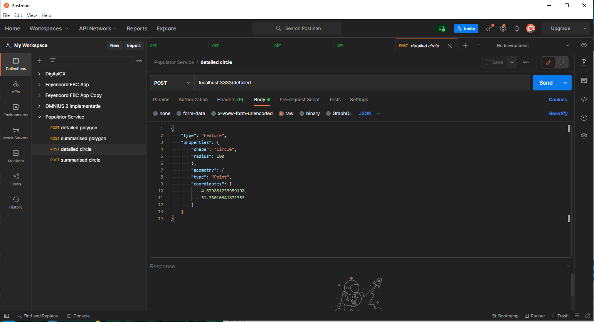

# populator

A population service for The Netherlands

to use the populator service you need to install the following software

- postgres
- python (64 bit version)
- docker
- nodejs / commandline
- postman

once you have correctly installed all of the progams above you can use the following commands in the populator/docker in the commandline

populator/docker docker compose up -d

chekck if the following images are created:

-floris881/population-service
-floris881/pop-service-db

if not use the following commands

- populator/ docker build ./packages/server
- populator/ docker build ./docker

there should be 2 docker images and container in your docker application in which you can now start and stop the populator service so there is no further need to use this project

you can now start the container in docker

With Postman you can check if you can collect the data
you can choose cirle or polygon and the coordinates you can get from geojson.io

for circle you use 1 coordinate and a radius in meters

for the polygon you use an array of coordinates

you can also place the data (if it is not to big) in the geojson.io json section so can visualy see your data

for further information about changing the data for the populator service read the other README files in the ./BAG_enrichment
